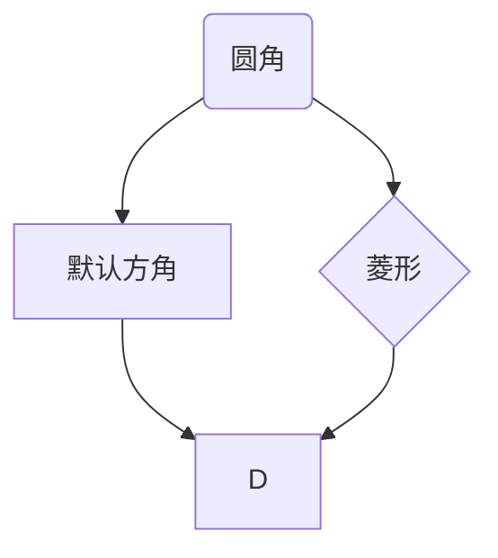

# Markdown的基本代码

# 一级标题
## 二级标题
### 三级标题
#### 四级标题
##### 五级标题
###### 六级标题
---
*三个减号是横格线    

普通字符  
*要换行在字符末尾加两个空格，并换行，或输入两个回车（会有间隔）。

*斜体* _斜体_

**加粗**  __加粗__

~~删除线~~

***粗斜体*** ___粗斜体___  

> 引用
>>嵌套二级
>>>嵌套三级
>>>>可无限嵌套

* 列表项 
    * 子项1
        * 最多支持三个子项
            * 超过三项前面的点就没有变化了

1. 列表项
100. 列表项
114514. 列表项  

第一项写多少后面就会按顺序往后排：

5. 列表项
100. 列表项
114514. 列表项

数学符号  

次方：$x^2$  
下标：$x_2$
特殊符号：例：$\Delta “$$”里输入符号名称  
根号：$\sqrt{2}$  
居中：必须是独立的行，不能有其他字符。
$$114514$$

代码显示：
~~~python
print(Hello world)
~~~
流程图（需要扩展“Markdown Preview Mermaid Support”）：

表格：  
|默认（靠左对齐）|靠右对齐|居中对齐|
|:------|-------:|:------:|
|物品111 |物品222 |物品333 |
|物品11  |物品22  |物品33  |
|物品1   |物品2   |物品3   |

超链接：[要显示的文字](网址)  
测试：[@Zerwd的B站](https://space.bilibili.com/3493133788646349)